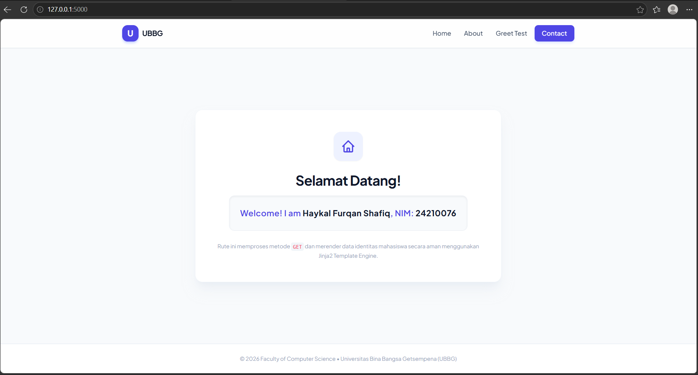
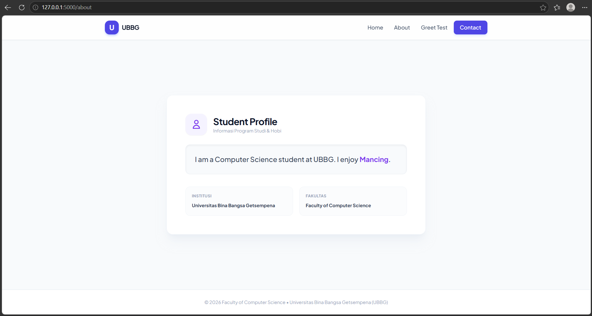
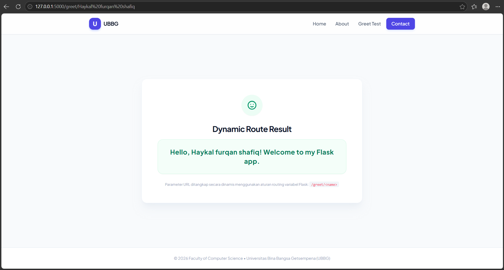
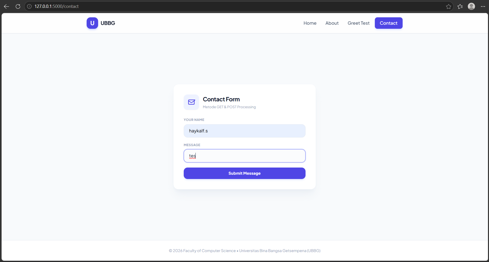
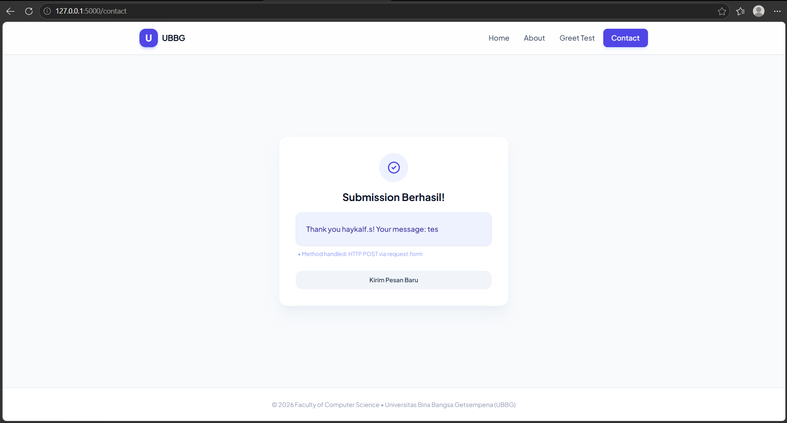
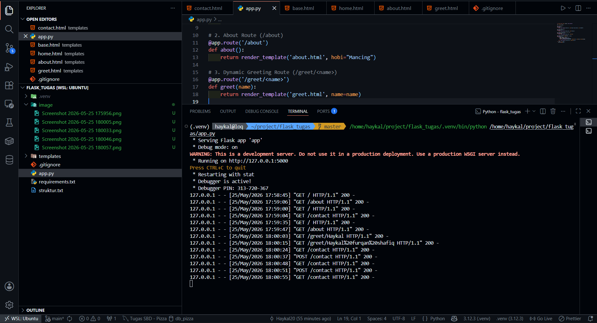

# 🎓 Student Personal Page - Flask & Tailwind CSS


Repositori ini berisi implementasi aplikasi web berbasis **Flask** untuk memenuhi tugas **Meeting 9 - OOP Implementation with Flask** pada Fakultas Ilmu Komputer, Universitas Bina Bangsa Getsempena (UBBG). 

Aplikasi ini mendemonstrasikan penggunaan *routing* dasar, *dynamic routing*, penanganan *HTTP methods* (GET & POST), serta pemisahan logika *backend* dan tampilan *frontend* menggunakan **Jinja2 Template Engine** yang dikombinasikan dengan **Tailwind CSS**.

---

## 👤 Informasi Mahasiswa
* **Nama Lengkap:** Haykal Furqan Shafiq
* **NIM:** 24210076
* **Program Studi:** Computer Science, UBBG

---

## ✨ Fitur & Routing Aplikasi

1. 🏠 **Home Route (`/`)**
   Memproses request `GET` untuk menampilkan pesan selamat datang beserta identitas mahasiswa (Nama dan NIM).
2. 📖 **About Route (`/about`)**
   Memproses request `GET` untuk menampilkan informasi singkat mengenai program studi dan hobi.
3. 👋 **Dynamic Greeting Route (`/greet/<name>`)**
   Mendemonstrasikan *Dynamic URL Routing*. Menangkap parameter string dari URL dan menampilkannya sebagai sapaan personal.
4. ✉️ **Contact Form Route (`/contact`)**
   * **`GET`**: Menampilkan antarmuka formulir kontak.
   * **`POST`**: Memproses data yang di-*submit* pengguna menggunakan `request.form` dan menampilkan pesan konfirmasi.

---

## 📸 Dokumentasi Antarmuka (Screenshots)

Berikut adalah hasil pengujian antarmuka aplikasi yang telah dirancang menggunakan Tailwind CSS:

### 1. Halaman Utama (Home)


### 2. Halaman Profil (About)


### 3. Halaman Sapaan Dinamis (Dynamic Greeting)


### 4. Form Kontak (HTTP GET)


### 5. Hasil Pengiriman Pesan (HTTP POST)


### 6. Log Terminal (WSL2 / Ubuntu)
Bukti *Flask Development Server* berjalan dalam *Debug Mode* beserta histori HTTP Request.


---

## 📂 Struktur Direktori

Detail susunan folder dan berkas proyek ini telah didokumentasikan secara terpisah. Anda dapat melihat pohon direktori lengkapnya di bawah ini:

<details>
<summary>📁 <b>Klik untuk melihat struktur isi file struktur.txt</b></summary>

```text
├── app.py                      # File utama aplikasi backend Flask
├── README.md                   # Dokumentasi utama proyek GitHub (Markdown)
├── requirements.txt            # Daftar dependensi/library Python yang digunakan
├── struktur.txt                # File dokumentasi pohon direktori proyek
├── screenshot/                 # Folder penyimpanan berkas dokumentasi pengujian
│   ├── home.png                # Halaman Utama (/) menampilkan Identitas & NIM
│   ├── about.png               # Halaman Profil (/about) menampilkan Program Studi & Hobi
│   ├── great_route.png         # Halaman (/greet/<name>) hasil pengujian rute dinamis
│   ├── contact_get.png         # Tampilan awal Form Kontak (/contact) via HTTP GET
│   ├── contast_post.png        # Tampilan setelah sukses kirim pesan via HTTP POST
│   └── terminal.png            # Log Terminal WSL2 bukti Flask server running (Debug Mode)
└── templates/                  # Folder penyimpanan berkas UI Frontend (Jinja2 Templates)
    ├── base.html               # Template induk (kerangka utama, navbar, footer, & Tailwind CDN)
    ├── home.html               # Template konten untuk Halaman Utama
    ├── about.html              # Template konten untuk Halaman Profil
    ├── greet.html              # Template konten untuk Halaman Sapaan Dinamis
    └── contact.html            # Template konten untuk Form Kontak & Status Pengiriman

3 directories, 14 files